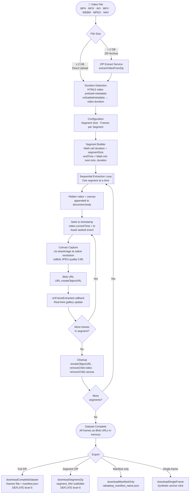
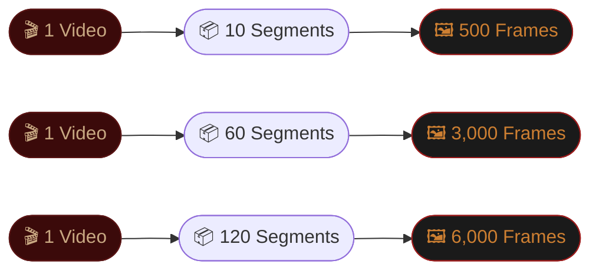
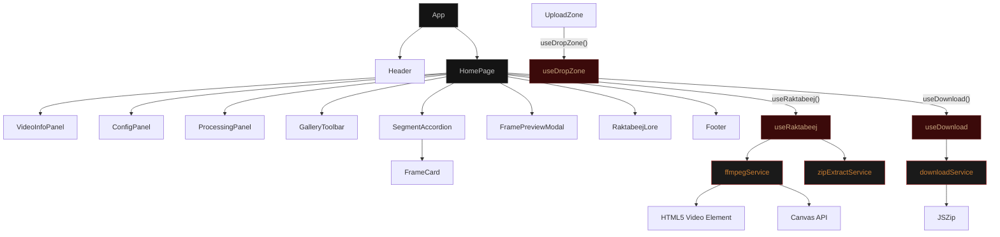
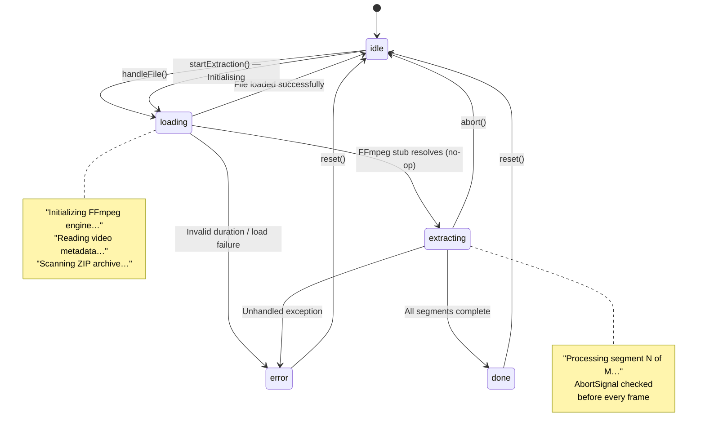
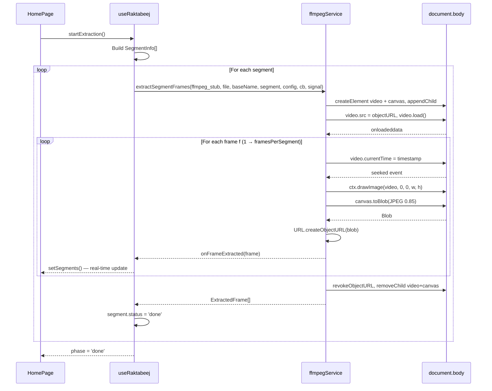
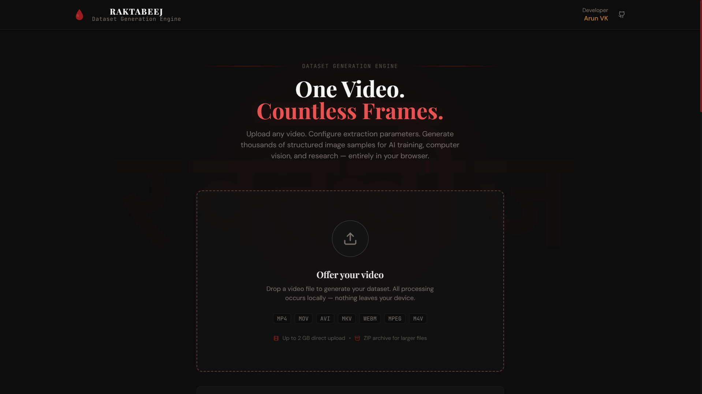
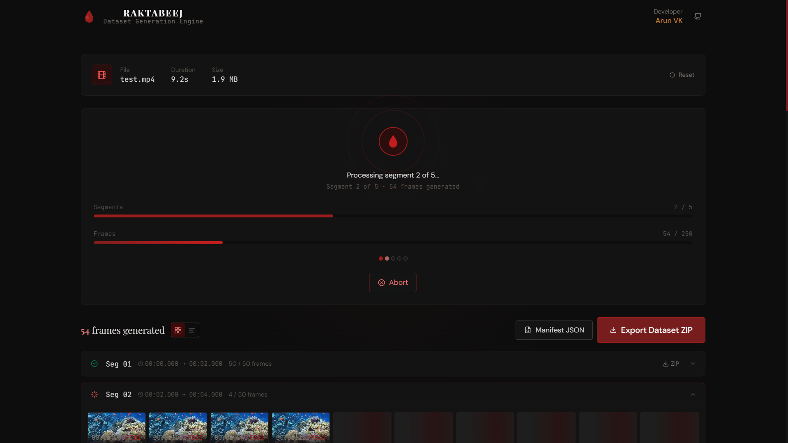
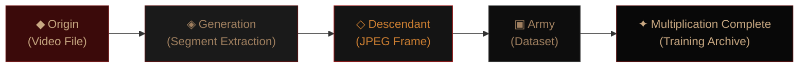
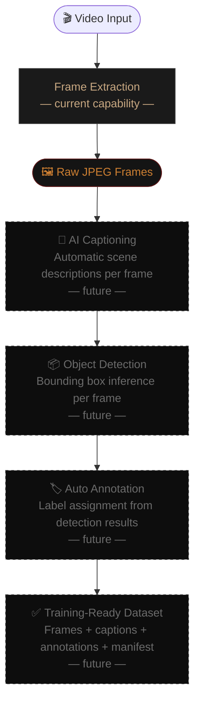

<!--
═══════════════════════════════════════════════════════════════════════════════
  RAKTABEEJ — DATASET GENERATION ENGINE
  Flagship README · Ancient Blood Chronicle Edition
═══════════════════════════════════════════════════════════════════════════════
-->

<div align="center">

<!--
┌─────────────────────────────────────────────────────────────────────────────┐
│  HERO BANNER — INSERT BEFORE PUBLISHING                                      │
│                                                                              │
│  Recommended dimensions : 1280 × 400 px                                     │
│  Visual concept                                                              │
│    · Matte charcoal background  (#0d0d0d)                                    │
│    · Aged parchment texture overlay  (opacity ~0.08)                         │
│    · Centred Sanskrit glyph रक्तबीज at ~180 px, opacity 0.12               │
│    · Below glyph: "RAKTABEEJ" in serif letterpress, copper tone (#cd7f32)    │
│    · Tagline beneath: "Dataset Generation Engine"                            │
│    · No gradients · No glow · No neon · Matte only                          │
│                                                                              │
│  Replace this block with:                                                    │
│          │
└─────────────────────────────────────────────────────────────────────────────┘
-->

# RAKTABEEJ

### रक्तबीज · Dataset Generation Engine

*One video. Countless frames. Structured lineage — entirely in your browser.*

<br>


<br>

---

*"As each drop of Raktabeej's blood fell, another arose equal in power."*
<br>— Devi Mahatmya, Markandeya Purana

---

</div>

<br>

## Contents

<div align="center">

| § | Section | § | Section |
|:---:|---------|:---:|---------|
| [01](#01--what-is-raktabeej) | What Is Raktabeej? | [11](#11--project-structure) | Project Structure |
| [02](#02--the-bloodline--pipeline-overview) | The Bloodline — Pipeline Overview | [12](#12--screenshots) | Screenshots |
| [03](#03--the-multiplication--scale-visualised) | The Multiplication — Scale Visualised | [13](#13--local-development) | Local Development |
| [04](#04--how-it-actually-works) | How It Actually Works | [14](#14--deployment-on-render) | Deployment on Render |
| [05](#05--features) | Features | [15](#15--design-system) | Design System |
| [06](#06--supported-input-formats) | Supported Input Formats | [16](#16--use-cases) | Use Cases |
| [07](#07--configuration-options) | Configuration Options | [17](#17--the-legend) | The Legend |
| [08](#08--output-format) | Output Format | [18](#18--future-vision--raktabeej-ai) | Future Vision — Raktabeej AI |
| [09](#09--architecture) | Architecture | [19](#19--developer) | Developer |
| [10](#10--tech-stack) | Tech Stack | [20](#20--license) | License |

</div>

<br>

---

<br>

<!--
═══════════════════════════════════════════════════════════════════════════════
  01 · WHAT IS RAKTABEEJ
═══════════════════════════════════════════════════════════════════════════════
-->

## 01 · What Is Raktabeej?

Raktabeej is a **browser-based video-to-image-dataset engine**. Drop in a video, configure how you want it sliced, and it produces hundreds or thousands of named, timestamped JPEG frames organised by segment — ready for annotation pipelines, computer vision training, or research.

Everything runs locally. No server. No upload. No data ever leaves the browser tab.

<br>

> **Core Lineage Concept**
>
> ```
> One Source  ──►  Segments  ──►  Frames  ──►  Manifest  ──►  Dataset
> (Video)          (Slices)       (JPEGs)       (JSON)         (Archive)
> ```
>
> Each frame carries its lineage in its filename.
> Each filename encodes its ancestry.
> Nothing is anonymous. Everything is traceable.

<br>

---

<br>

<!--
═══════════════════════════════════════════════════════════════════════════════
  02 · THE BLOODLINE — PIPELINE OVERVIEW
═══════════════════════════════════════════════════════════════════════════════
-->

## 02 · The Bloodline — Pipeline Overview

> *In myth, one drop of blood became an army. In engineering, one video becomes a dataset.*

<br>



<br>

---

<br>

<!--
═══════════════════════════════════════════════════════════════════════════════
  03 · THE MULTIPLICATION — SCALE VISUALISED
═══════════════════════════════════════════════════════════════════════════════
-->

## 03 · The Multiplication — Scale Visualised

> *Every seed equal in strength to the source.*

<br>

### Lineage at Scale

```
1 Video (120 seconds)
│
├─── Segment Size: 2s
│    └─── 60 Segments generated
│
├─── Frames per Segment: 50
│    └─── 3,000 Frames extracted
│
├─── Each frame:
│    ├─── Named:        drone_footage_segment_01_frame_001.jpg
│    ├─── Timestamped:  00:00.000 → 02:00.000
│    └─── Encoded:      JPEG · 0.85 quality · native resolution
│
└─── Output:
     ├─── frames/             (3,000 JPEG files)
     ├─── manifest.json       (machine-readable lineage)
     └─── raktabeej_dataset_drone_footage.zip
```

<br>

### Multiplication Chart



<br>

### Scale Reference Table

| Video Duration | Segment Size | Segments | Frames/Seg | Total Frames |
|:--------------:|:------------:|:--------:|:----------:|:------------:|
| 30 s | 2 s | 15 | 50 | 750 |
| 60 s | 2 s | 30 | 50 | 1,500 |
| 120 s | 2 s | 60 | 50 | **3,000** |
| 120 s | 1 s | 120 | 50 | **6,000** |
| 300 s | 2 s | 150 | 100 | **15,000** |

<br>

---

<br>

<!--
═══════════════════════════════════════════════════════════════════════════════
  04 · HOW IT ACTUALLY WORKS
═══════════════════════════════════════════════════════════════════════════════
-->

## 04 · How It Actually Works

> **⚠ Implementation Note on FFmpeg**
>
> Despite `@ffmpeg/ffmpeg` being listed in `package.json` and the UI displaying the message *"Initializing FFmpeg engine…"*, **FFmpeg WebAssembly is not used** for frame extraction. The `loadFFmpeg`, `getFFmpegForSegment`, and `destroyFFmpeg` exports in `ffmpegService.ts` are all explicit no-op stubs kept purely for API compatibility. Frame extraction is done entirely with the browser's native **HTML5 `<video>` element and Canvas API**.

<br>

---

### Video Duration Detection · `ffmpegService.ts → getVideoDuration`

1. A temporary `<video>` element is created with `preload='metadata'`.
2. The video `File` is turned into an object URL and assigned as `video.src`.
3. On the `onloadedmetadata` event, `video.duration` is read and the object URL is immediately revoked.

<br>

---

### Frame Extraction · `ffmpegService.ts → extractSegmentFrames`

For each segment, a brand new `<video>` (muted, `preload='auto'`) and a `<canvas>` are created and appended to `document.body`. Then:

1. The video file is loaded via an object URL and awaited on `onloadeddata`.
2. For each frame `f` from `1` to `framesPerSegment`:
   - **Timestamp calculation** — frames are distributed evenly across the segment:
     - Single frame: captures the midpoint (`progress = 0.5`)
     - Multiple frames: `progress = (f - 1) / (framesPerSegment - 1)`, so frame 1 lands at `startTime`, the last frame lands at `endTime`
     - `timestamp = segment.startTime + progress × (segment.endTime − segment.startTime)`
   - The video element is seeked to that timestamp (`video.currentTime = timestamp`).
   - On the `seeked` event, the frame is drawn to canvas at the video's native resolution via `ctx.drawImage(video, 0, 0, canvas.width, canvas.height)`.
   - `canvas.toBlob(...)` encodes as **JPEG at 0.85 quality**.
   - The blob is converted to a blob URL and emitted via the `onFrameExtracted` callback.
   - If a frame capture fails, it is silently skipped (logged as a warning) and the loop continues.
3. After all frames in the segment are done, the object URL is revoked and both the `<video>` and `<canvas>` elements are removed from `document.body`.
4. The `AbortSignal` is checked before every frame — if aborted, the loop breaks early.

**`globalIndex`** for each frame is calculated as: `segment.index × framesPerSegment + f` (where `f` is 1-based).

<br>

---

### ZIP Input for Large Files · `zipExtractService.ts → extractVideoFromZip`

The 2 GB upload limit is enforced in `useDropZone`. For larger files, upload a ZIP. The service:

1. Loads the ZIP with JSZip.
2. Scans all non-directory entries and filters them using `isVideoFile()` (checks MIME type then extension).
3. Throws an error if zero video files are found, or if more than one is found.
4. Extracts the single video as a blob, re-wraps it as a `File` with the correct MIME type from a hardcoded lookup table (`mp4`, `mov`, `avi`, `mkv`, `webm`, `mpeg`/`mpg`, `m4v` → correct MIME; anything else defaults to `video/mp4`).
5. The filename used for the `File` is only the basename (anything after the last `/` in the path).

<br>

---

### Orchestration · `useRaktabeej.ts`

The `useRaktabeej` hook is the central state machine. It drives the app through these `ProcessingPhase` values (as actually set by the hook at runtime):

```
idle → loading → extracting → done
               ↘            ↘ (on abort → idle)
                error         error
```

> **Implementation Note:** `'segmenting'` and `'zipping'` are defined in the `ProcessingPhase` type and checked in the UI's `isProcessing` / `isActive` guards, but the hook never sets them at runtime. They are placeholder phases for possible future use.

On `startExtraction`:
1. Builds an array of `SegmentInfo` objects with `status: 'pending'`, computing `endTime = Math.min((i+1) × segmentSize, videoDuration)` so the last segment clips correctly.
2. The `videoBaseName` used for filenames is the `videoInfo.name` with its extension stripped (via `replace(/\.[^/.]+$/, '')`).
3. Loops through segments **sequentially** — one at a time, never parallel.
4. For each segment, the `onFrameExtracted` callback updates the segment's frame array and the global `totalFramesExtracted` counter in real time.
5. After each segment completes, its status is set to `'done'`. If it throws, status becomes `'error'` and the loop continues to the next segment.
6. If not aborted, the final phase is `'done'` with a message of `"Extraction complete. N frames generated."`.

**Abort** calls `AbortController.abort()` and immediately resets the phase back to `'idle'`.

**Reset** aborts any running extraction, clears `videoFileRef`, and resets all state to initial values. It does **not** explicitly revoke any blob URLs — the `revokeFrameUrls` function exists in `downloadService.ts` but is exported and never called anywhere in the app.

<br>

---

<br>

<!--
═══════════════════════════════════════════════════════════════════════════════
  05 · FEATURES
═══════════════════════════════════════════════════════════════════════════════
-->

## 05 · Features

| Feature | Detail |
|---------|--------|
| **Configurable segment duration** | Presets: 500ms, 1s, 2s, 5s, 10s · Custom: `min 0.1s` → full video duration |
| **Configurable frames per segment** | Presets: 10, 25, 50, 100 · Custom: integers 1–500 |
| **Live extraction progress** | Two progress bars (segments + frames), dot-grid visualiser (≤60 segs), real-time frame counter |
| **Grid view** | 5 columns → 8 at `sm` → 10 at `md`. Skeleton shimmer placeholders for pending frames |
| **Timeline view** | List layout: 64×36px thumbnail · timestamp `MM:SS.mmm` · filename. Hover-reveal Preview + Download |
| **Per-segment ZIP export** | `{videoBaseName}_segment_NN.zip` containing `segment_NN/` subfolder with frames |
| **Full dataset ZIP export** | `raktabeej_dataset_{sanitizedName}.zip` · `frames/` flat + `manifest.json` · DEFLATE level 6 |
| **Manifest-only download** | `raktabeej_manifest_{videoBaseName}.json` — JSON only, no re-zipping |
| **Frame lightbox** | Full-screen modal, `max-h-[75vh]` object-contain · `←` `→` `Escape` keyboard nav · inline Download |
| **Abort mid-extraction** | `AbortController` signal checked before every frame. Resets to `idle`. |
| **Zero server dependency** | All processing: native browser HTML5 Video + Canvas API |

<br>

---

<br>

<!--
═══════════════════════════════════════════════════════════════════════════════
  06 · SUPPORTED INPUT FORMATS
═══════════════════════════════════════════════════════════════════════════════
-->

## 06 · Supported Input Formats

**Direct upload — up to 2 GB:**

| Format | MIME Type checked |
|--------|-------------------|
| MP4 | `video/mp4` |
| MOV | `video/quicktime` |
| AVI | `video/x-msvideo` |
| MKV | `video/x-matroska` |
| WEBM | `video/webm` |
| MPEG / MPG | `video/mpeg` |
| M4V | `video/x-m4v` |

> **Note on `video/MP2T` (MPEG-2 Transport Stream):** Present in `SUPPORTED_VIDEO_TYPES` in `format.ts` and would pass `isVideoFile()` validation — but `.ts` is **not** listed in `SUPPORTED_EXTENSIONS`, not in the `<input accept>` attribute, and not shown in the UI badge list. It works only if the browser supplies the correct MIME type automatically.

**For files over 2 GB:** Wrap the video in a **ZIP archive** containing exactly one video file and upload the `.zip`.

<br>

---

<br>

<!--
═══════════════════════════════════════════════════════════════════════════════
  07 · CONFIGURATION OPTIONS
═══════════════════════════════════════════════════════════════════════════════
-->

## 07 · Configuration Options

### Segment Size

| Preset | Value | Behaviour |
|--------|-------|-----------|
| `500ms` | 0.5 s | Very fine-grained |
| `1s` | 1 s | Fine |
| `2s` | 2 s | **Default** |
| `5s` | 5 s | Medium |
| `10s` | 10 s | Coarse |
| Custom | `min="0.1"` · `max=videoDuration` · `step="0.1"` | Any positive float |

Total segments = `Math.ceil(videoDuration / segmentSize)`.

<br>

### Frames per Segment

| Preset | Value | Behaviour |
|--------|-------|-----------|
| `10` | 10 frames | Sparse |
| `25` | 25 frames | Light |
| `50` | 50 frames | **Default** |
| `100` | 100 frames | Dense |
| Custom | `min="1"` · `max="500"` · `step="1"` | Integer only |

Frames are distributed evenly across the segment's time range. Frame 1 always lands at `startTime` (for multi-frame segments), the last frame at `endTime`.

<br>

---

<br>

<!--
═══════════════════════════════════════════════════════════════════════════════
  08 · OUTPUT FORMAT
═══════════════════════════════════════════════════════════════════════════════
-->

## 08 · Output Format

### File Naming Convention

```
{sanitizedBaseName}_segment_{NN}_frame_{NNN}.jpg
```

`sanitizedBaseName` is produced by `sanitizeFilename(videoBaseName)`:
- Strips the file extension.
- Replaces any character outside `[a-zA-Z0-9._-]` with `_`.
- Collapses consecutive underscores into one.

`NN` = segment index — 1-based, 2-digit zero-padded.
`NNN` = frame index within segment — 1-based, 3-digit zero-padded.

**Example:**
```
drone footage 2024.mp4  →  drone_footage_2024_segment_01_frame_001.jpg
                            drone_footage_2024_segment_01_frame_002.jpg
                            drone_footage_2024_segment_02_frame_001.jpg
```

**Ancestry encoded in every filename:**
```
{video}  →  _segment_{NN}  →  _frame_{NNN}.jpg
 Origin       Generation         Descendant
```

<br>

---

### Dataset Manifest (`manifest.json`)

Generated for both the full ZIP export and the manifest-only download:

```json
{
  "video_name": "drone_footage.mp4",
  "duration": 120.5,
  "total_segments": 60,
  "frames_per_segment": 50,
  "total_frames": 3000,
  "segment_size_seconds": 2,
  "generated_at": "2025-01-15T10:30:00.000Z",
  "segments": [
    {
      "index": 1,
      "start": 0,
      "end": 2,
      "frames": [
        "drone_footage_segment_01_frame_001.jpg",
        "drone_footage_segment_01_frame_002.jpg"
      ]
    }
  ]
}
```

> **Note:** `index` in the manifest is 1-based. `start` and `end` are in seconds. `total_frames` reflects frames actually extracted — not the configured target, since frames that fail canvas capture are silently skipped.

<br>

---

### ZIP Structures

**Per-segment ZIP** — `{videoBaseName}_segment_NN.zip`:

```
segment_01/
  video_segment_01_frame_001.jpg
  video_segment_01_frame_002.jpg
  ...
```

**Full dataset ZIP** — `raktabeej_dataset_{sanitizedBaseName}.zip`:

```
frames/
  video_segment_01_frame_001.jpg
  video_segment_01_frame_002.jpg
  ...
  video_segment_NN_frame_NNN.jpg
manifest.json
```

<br>

---

<br>

<!--
═══════════════════════════════════════════════════════════════════════════════
  09 · ARCHITECTURE
═══════════════════════════════════════════════════════════════════════════════
-->

## 09 · Architecture

### Component Tree



<br>

---

### State Machine



<br>

---

### Data Flow — Frame Extraction



<br>

---

<br>

<!--
═══════════════════════════════════════════════════════════════════════════════
  10 · TECH STACK
═══════════════════════════════════════════════════════════════════════════════
-->

## 10 · Tech Stack

| Layer | Technology | Version | Notes |
|-------|-----------|---------|-------|
| Framework | React (StrictMode) | 18.3.1 | |
| Language | TypeScript | 5.2.2 | |
| Build Tool | Vite | 5.3.1 | Manual Rollup chunking |
| Styling | Tailwind CSS | 3.4.4 | Custom "Ancient Blood Chronicle" theme |
| Frame Extraction | HTML5 `<video>` + Canvas API | Native browser | No WASM — native browser only |
| ZIP Generation | JSZip | 3.10.1 | DEFLATE level 6 for all ZIPs |
| Icons | Lucide React | 0.395.0 | |
| Fonts | Playfair Display · DM Sans · JetBrains Mono | — | Google Fonts |
| Deployment | Render (Static Site) | — | `render.yaml` zero-config |

> **On `@ffmpeg/ffmpeg` (0.12.10) and `@ffmpeg/util` (0.12.2):** Both are in `package.json` and bundled into their own Rollup chunk — but **not used at runtime**. The `SharedArrayBuffer` / COOP / COEP headers in `vite.config.ts` and `render.yaml` are therefore not strictly required but remain in place as legacy configuration.

<br>

---

<br>

<!--
═══════════════════════════════════════════════════════════════════════════════
  11 · PROJECT STRUCTURE
═══════════════════════════════════════════════════════════════════════════════
-->

## 11 · Project Structure

```
src/
├── main.tsx                      # React root, mounts <App> in StrictMode
├── App.tsx                       # Renders <Header> (no props) + <HomePage> in <main>
├── index.css                     # Tailwind layers, all custom component classes, keyframes
│
├── pages/
│   └── HomePage.tsx              # Full page: phase routing, gallery, lightbox state
│
├── components/
│   ├── index.ts                  # Barrel exports for all 11 components
│   ├── Header.tsx                # Top bar: SVG blood-drop logo, title, GitHub link, dev credit
│   │                             # Accepts onReset/showReset props but App.tsx calls it with no props
│   ├── UploadZone.tsx            # Drag-drop zone, format badges, 2-ring pulse on drag, error display
│   ├── ConfigPanel.tsx           # Segment + frame preset buttons; custom number inputs with constraints
│   ├── VideoInfoPanel.tsx        # Shows filename, duration, file size (not MIME type); Reset button
│   ├── ProcessingPanel.tsx       # 3-ring pulse, blood-drop SVG, two progress bars, dot grid (≤60 segs), Abort
│   ├── GalleryToolbar.tsx        # Frame count, Grid/Timeline toggle, Export ZIP button, Manifest JSON button
│   ├── SegmentAccordion.tsx      # Collapsible segment row with status icon; per-segment ZIP (done only)
│   │                             # Auto-opens when segment.status is 'processing' or 'done'
│   ├── FrameCard.tsx             # Thumbnail with timestamp + frame index footer; hover overlay: Preview + Download
│   │                             # .new class triggers seed-expand animation (0.4s CSS, not Tailwind utility)
│   ├── FramePreviewModal.tsx     # Full-screen lightbox (75vh max), ←/→/Escape keyboard nav, Download
│   ├── RaktabeejLore.tsx         # Mythology section, use-case grid (9 items)
│   └── Footer.tsx                # Brand tagline, email / LinkedIn / GitHub icon links
│
├── hooks/
│   ├── useRaktabeej.ts           # State machine: file loading, segment building, sequential extraction loop
│   │                             # Phases actually used at runtime: idle, loading, extracting, done, error
│   ├── useDropZone.ts            # Drag events with ref counter; validates type + 2 GB size limit
│   └── useDownload.ts            # Progress-tracked wrappers: single frame, segment ZIP, full ZIP, manifest
│
├── services/
│   ├── ffmpegService.ts          # getVideoDuration() via <video preload='metadata'>
│   │                             # extractSegmentFrames() via hidden <video>+<canvas>, JPEG 0.85 quality
│   │                             # loadFFmpeg / getFFmpegForSegment / destroyFFmpeg → all no-ops (stubs)
│   ├── downloadService.ts        # downloadSingleFrame (synthetic <a> click)
│   │                             # downloadSegmentZip (JSZip with segment_NN/ subfolder, DEFLATE level 6)
│   │                             # downloadCompleteDataset (frames/ flat + manifest.json, DEFLATE level 6)
│   │                             # downloadManifestOnly (Blob JSON download)
│   │                             # revokeFrameUrls — exported but never called anywhere in the app
│   └── zipExtractService.ts      # extractVideoFromZip: validates exactly 1 video, MIME lookup, basename only
│
├── utils/
│   └── format.ts                 # formatDuration · formatFileSize · formatTimestamp (MM:SS.mmm / H:MM:SS.mmm)
│                                 # sanitizeFilename · isVideoFile · isZipFile
│                                 # computeSegmentCount (Math.ceil) · computeTotalFrames
│                                 # generateFrameFilename · clamp
│
└── types/
    └── index.ts                  # ProcessingConfig · VideoInfo · SegmentInfo · ExtractedFrame
                                  # DatasetManifest · ProcessingPhase (7 values) · ProcessingState
                                  # GalleryView ('grid' | 'timeline')
                                  # SegmentSize · FramesPerSegment (exported but unused at runtime)
```

<br>

---

<br>

<!--
═══════════════════════════════════════════════════════════════════════════════
  12 · SCREENSHOTS
═══════════════════════════════════════════════════════════════════════════════
-->

## 12 · Screenshots

<br>

### Application Gallery

> *Replace each placeholder with actual screenshot files before publishing.*

<br>

**Upload Zone** — Drag-drop interface with format badges, 2-ring pulse animation on drag-over

<!--
┌──────────────────────────────────────────────────────────────────────────────┐
│  SCREENSHOT PLACEHOLDER — Upload Zone                                        │
│  Dimensions  :  900 × 500 px                                                 │
│  Replace with:                          │
└──────────────────────────────────────────────────────────────────────────────┘
-->

<br>

**Configuration Panel** — Segment size presets + frames-per-segment presets with live summary

<!--
┌──────────────────────────────────────────────────────────────────────────────┐
│  SCREENSHOT PLACEHOLDER — Configuration + Processing                         │
│  Dimensions  :  900 × 500 px                                                 │
│  Replace with:                         │
└──────────────────────────────────────────────────────────────────────────────┘
-->

<br>

**Processing Panel** — Blood-drop SVG, 3-ring pulse, dual progress bars, dot-grid segment visualiser

<!--
┌──────────────────────────────────────────────────────────────────────────────┐
│  SCREENSHOT PLACEHOLDER — Processing Panel                                   │
│  Dimensions  :  900 × 500 px                                                 │
│  Replace with:                     │
└──────────────────────────────────────────────────────────────────────────────┘
-->

<br>

**Grid View** — Responsive thumbnail grid (5→8→10 cols) with real-time frame pop-in

<!--
┌──────────────────────────────────────────────────────────────────────────────┐
│  SCREENSHOT PLACEHOLDER — Grid View Gallery                                  │
│  Dimensions  :  900 × 600 px                                                 │
│  Replace with:                            │
└──────────────────────────────────────────────────────────────────────────────┘
-->

<br>

**Timeline View** — List layout: thumbnail · timestamp · filename · hover actions

<!--
┌──────────────────────────────────────────────────────────────────────────────┐
│  SCREENSHOT PLACEHOLDER — Timeline View + Lightbox                           │
│  Dimensions  :  900 × 600 px                                                 │
│  Replace with:                        │
└──────────────────────────────────────────────────────────────────────────────┘
-->

<br>

**Frame Lightbox** — Full-screen preview with keyboard navigation and download button

<!--
┌──────────────────────────────────────────────────────────────────────────────┐
│  SCREENSHOT PLACEHOLDER — Frame Lightbox                                     │
│  Dimensions  :  900 × 600 px                                                 │
│  Replace with:                       │
└──────────────────────────────────────────────────────────────────────────────┘
-->

<br>

**ZIP Export** — Gallery toolbar showing Export Dataset ZIP with progress indicator

<!--
┌──────────────────────────────────────────────────────────────────────────────┐
│  SCREENSHOT PLACEHOLDER — ZIP Export                                         │
│  Dimensions  :  900 × 400 px                                                 │
│  Replace with:                           │
└──────────────────────────────────────────────────────────────────────────────┘
-->

<br>

| Screen | Description | Dimensions |
|--------|-------------|:----------:|
| Upload Zone | Drag-drop interface with format badges and 2-ring pulse | 900 × 500 |
| Configuration Panel | Segment + frame presets with live segment count summary | 900 × 500 |
| Processing Panel | 3-ring pulse · dual progress bars · dot-grid visualiser | 900 × 500 |
| Grid View | 5→8→10 column responsive thumbnail grid | 900 × 600 |
| Timeline View | List layout with timestamp and hover actions | 900 × 600 |
| Frame Lightbox | Full-screen modal with keyboard navigation | 900 × 600 |
| ZIP Export | Toolbar with export controls and progress indicator | 900 × 400 |

<br>

---

<br>

<!--
═══════════════════════════════════════════════════════════════════════════════
  13 · LOCAL DEVELOPMENT
═══════════════════════════════════════════════════════════════════════════════
-->

## 13 · Local Development

### Prerequisites

- Node.js 18+
- npm 9+

### Setup

```bash
git clone https://github.com/ArunVijaykumarcsds/raktabeej
cd raktabeej
npm install
npm run dev
```

Dev server starts at `http://localhost:5173`.

### Build

```bash
npm run build       # tsc + vite build → dist/
npm run preview     # serve dist/ locally
npm run lint        # @typescript-eslint + react-hooks + react-refresh
```

The build splits output into three Rollup chunks:

```js
manualChunks: {
  react:  ['react', 'react-dom'],
  ffmpeg: ['@ffmpeg/ffmpeg', '@ffmpeg/util'],  // bundled but unused at runtime
  jszip:  ['jszip'],
}
```

<br>

---

<br>

<!--
═══════════════════════════════════════════════════════════════════════════════
  14 · DEPLOYMENT ON RENDER
═══════════════════════════════════════════════════════════════════════════════
-->

## 14 · Deployment on Render

The repo includes `render.yaml` for zero-config static site deployment:

```yaml
services:
  - type: web
    name: raktabeej
    env: static
    buildCommand: npm install && npm run build
    staticPublishPath: dist
    headers:
      - path: /*
        name: Cross-Origin-Opener-Policy
        value: same-origin
      - path: /*
        name: Cross-Origin-Embedder-Policy
        value: require-corp
    routes:
      - type: rewrite
        source: /*
        destination: /index.html
```

**Steps:** Push to GitHub → New Static Site on [Render](https://render.com) → Connect repo → Deploy. `render.yaml` is auto-detected, no manual configuration required.

> The COOP/COEP headers are a legacy of when FFmpeg WASM was the active extraction method. The SPA rewrite rule sends all paths to `index.html` for client-side routing.

<br>

---

<br>

<!--
═══════════════════════════════════════════════════════════════════════════════
  15 · DESIGN SYSTEM
═══════════════════════════════════════════════════════════════════════════════
-->

## 15 · Design System

Defined in `tailwind.config.js` (custom theme tokens) and `index.css` (component classes and keyframes).

### Color Palette — "Ancient Blood Chronicle"

| Token | Key Values | Purpose |
|-------|-----------|---------|
| `blood` | `600: #c81e1e` · `700: #9b1c1c` · `800: #771d1d` · `950: #3b0a0a` | Primary accent — buttons, active states, progress bars, borders |
| `charcoal` | `800: #1a1a1a` · `850: #141414` · `900: #0d0d0d` · `950: #080808` | All background surfaces |
| `copper` | `400: #cd7f32` | Developer name highlight; also `.text-copper` CSS class |
| `parchment` | `100–900` warm scale | Available in palette, not heavily used in UI |
| `stone` | Tailwind built-in | All secondary text, borders, muted labels |

### Typography

| Token | Font | Weights | Used for |
|-------|------|---------|---------|
| `font-serif` | Playfair Display | 400, 600, 700 (+ italics) | Headings, logo, lore text, large stat numbers |
| `font-sans` | DM Sans | 300, 400, 500 | Body, labels, descriptions, buttons |
| `font-mono` | JetBrains Mono | 400, 500 | Timestamps, filenames, counters, config values |

### Custom CSS Classes

| Class | Description |
|-------|-------------|
| `.rb-bg` | Fixed full-viewport element. `::before` = red radial glow (animated by `diffuse`, 8s). `::after` = Sanskrit watermark `रक्तबीज` at `clamp(120px, 20vw, 260px)`, opacity 0.03 |
| `.panel` | Card base: `bg-charcoal-850/80 border border-stone-800/50 rounded-lg backdrop-blur-sm` |
| `.btn-primary` | Blood-red filled button (`bg-blood-800`, hover `bg-blood-700`) |
| `.btn-secondary` | Dark outlined button (`bg-charcoal-850`, stone border) |
| `.cfg-btn` | Compact config preset toggle. `.active` state: `border-blood-600 bg-blood-950/60` |
| `.frame-card` | Thumbnail card with hover lift (`translateY(-2px)`) and border highlight. `.new` triggers `seed-expand` |
| `.skeleton` | Shimmer placeholder for pending frames during extraction |
| `.ornament` | Decorative horizontal rule with centred text, blood-coloured flanking lines |
| `.section-title` | `font-serif font-semibold` with `letter-spacing: 0.08em` |
| `.text-blood-accent` | `text-blood-500` + red text-shadow glow |
| `.text-copper` / `.border-copper` | Exact copper `#cd7f32` |
| `.ring-pulse` | Expanding ring circle (`border: 1px solid rgba(155,28,28,0.5)`, `ring-expand` keyframe, 2s infinite). Used in UploadZone (2 rings on drag) and ProcessingPanel (3 rings during active). Header logo ring only shows when `showReset={true}` — which `App.tsx` never passes. |
| `.progress-pulse` | Alias for `pulse-blood` animation — defined but not visibly used in current components |

### Keyframe Animations

| Name | Effect | Duration |
|------|--------|----------|
| `pulse-blood` | Opacity 1↔0.7 + scale 1↔1.04 | 2s infinite |
| `seed-expand` | Scale 0.4→1.03→1.0, opacity 0→1 — used on `.frame-card.new` via **CSS** at **0.4s** (Tailwind `animate-seed-expand` registers 1.5s but is not applied to `.frame-card.new`) |
| `diffuse` | Opacity 0.6↔1.0 on `.rb-bg::before` | **8s** infinite (CSS) — Tailwind config registers 3s but CSS wins |
| `shimmer` | Background-position sweep on `.skeleton` | 1.8s infinite |
| `ring-expand` | Scale 1→2.5, opacity 0.6→0 on `.ring-pulse` | 2s infinite |

<br>

---

<br>

<!--
═══════════════════════════════════════════════════════════════════════════════
  16 · USE CASES
═══════════════════════════════════════════════════════════════════════════════
-->

## 16 · Use Cases

> *Datasets generated by Raktabeej serve as structured input to downstream research and production pipelines.*

<br>

| Domain | Application |
|--------|-------------|
| 🔬 Computer Vision | Training image classifiers, feature extractors |
| 📦 Object Detection | Generating frame sequences for bounding-box annotation |
| 📡 SAR Image Analysis | Synthetic Aperture Radar frame sequence datasets |
| 🌍 Remote Sensing | Aerial and satellite video frame extraction |
| 📷 Surveillance Analytics | Frame sampling from security or field footage |
| ⏳ Temporal Sequence Learning | Sequential frame datasets for video understanding models |
| 🏛 Scene Understanding | Diverse scene composition datasets |
| ⚠ Anomaly Detection | Generating labelled normal/anomaly frame sets |
| 🎓 Research & Academia | Reproducible dataset generation for publications |

<br>

---

<br>

<!--
═══════════════════════════════════════════════════════════════════════════════
  17 · THE LEGEND
═══════════════════════════════════════════════════════════════════════════════
-->

## 17 · The Legend

### Who Was Raktabeej?

Raktabeej (रक्तबीज) — Sanskrit for *"blood-seed"* or *"he whose seeds are drops of blood"* — is a general from the *Devi Mahatmya* (Markandeya Purana). He possessed a boon from Brahma: every drop of his blood touching the earth instantly created a new warrior of equal strength. This made him impossible to defeat through ordinary combat — every wound only multiplied him.

The goddess Kali resolved the paradox by consuming every drop before it could reach the earth, cutting off the multiplication at its source.

> *"As each drop of blood fell from Raktabeej's body, another Raktabeej equal in valour and prowess arose. The gods were filled with great fear at this sight."*
> — Devi Mahatmya, Markandeya Purana

<br>

---

### The Bloodline Philosophy

This project harnesses that multiplication deliberately — not as chaos, but as structured lineage.

| Mythological Element | Engineering Equivalent |
|---------------------|------------------------|
| **Origin** — Raktabeej himself | The source video file |
| **Generation** — the wound | The segment extraction event |
| **Descendant** — each blood-drop warrior | Each extracted JPEG frame |
| **Army** — the multiplied force | The assembled dataset |
| **Multiplication Complete** — the battlefield | The training-ready archive |

Every frame carries its lineage in its name. Every filename encodes its ancestry:

```
{video}  →  _segment_{NN}  →  _frame_{NNN}.jpg
 Origin       Generation         Descendant
```

The multiplication is not random. It is governed, structured, and purposeful. One source. Countless descendants. Each equal in resolution and quality to the origin frame.

<br>



<br>

> *The account of Raktabeej presented here is drawn from the* Devi Mahatmya *and is included as the cultural and philosophical inspiration behind the project's name. It is not intended as a theological or academic claim.*

<br>

---

<br>

<!--
═══════════════════════════════════════════════════════════════════════════════
  18 · FUTURE VISION — RAKTABEEJ AI
═══════════════════════════════════════════════════════════════════════════════
-->

## 18 · Future Vision — Raktabeej AI

> **This section describes future capabilities. None of the following exists in the current release.**

The current engine produces raw, unnamed frames. A future evolution — **Raktabeej AI** — would extend the pipeline to produce *semantically annotated*, training-ready datasets automatically.

<br>



<br>

### Roadmap

| Stage | Status | Description |
|-------|:------:|-------------|
| Frame Extraction | ✅ **Current** | HTML5 Video + Canvas, JPEG 0.85, named frames |
| Dataset Manifest | ✅ **Current** | Machine-readable JSON lineage |
| AI Captioning | 🔲 Future | Per-frame scene descriptions from vision-language models |
| Object Detection | 🔲 Future | Bounding box inference over extracted frames |
| Auto Annotation | 🔲 Future | Structured label assignment from detection outputs |
| Training-Ready Export | 🔲 Future | Frames + captions + annotations + manifest in one archive |

<br>

---

<br>

<!--
═══════════════════════════════════════════════════════════════════════════════
  19 · DEVELOPER
═══════════════════════════════════════════════════════════════════════════════
-->

## 19 · Developer

<div align="center">

<br>

**Arun VK**

[arunvk.tech@gmail.com](mailto:arunvk.tech@gmail.com) · [LinkedIn](https://www.linkedin.com/in/arunvk2004/) · [GitHub](https://github.com/ArunVijaykumarcsds)

<br>

</div>

---

<br>

<!--
═══════════════════════════════════════════════════════════════════════════════
  20 · LICENSE
═══════════════════════════════════════════════════════════════════════════════
-->

## 20 · License

MIT — free to use, modify, and distribute.

<br>

---

<div align="center">

<br>

*Built with HTML5 Video · Canvas API · React · TypeScript · Tailwind CSS · Vite · JSZip*

<br>

**रक्तबीज**

*One seed. Countless descendants.*

<br>

</div>
